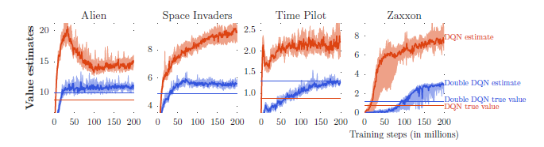

### 1.DQN
[paper](https://arxiv.org/abs/1312.5602) **DQN(early)**
### 2.DQN(nature)
[paper link](https://www.nature.com/articles/nature14236) **DQN(Nature)**

    <b> 图1. DQN nature版本框架 </b>

$$Q^\ast(s, a)=\mathbb{E}_{s^{\prime}\sim\mathcal{E}}\left[r+\gamma\underset{a^{\prime}}{max}Q^{\ast}\left(s^{\prime}, a^{\prime};\bar{\theta}_{i}\right) \mid \mathrm{s}, \mathrm{a}\right]$$

$$\text{令}y_i = \mathbb{E}_{s^{'}\sim\mathcal{E}}\left[r+\gamma\underset{a^{'}}{max}Q^*(s^{'},a^{'};\bar{\theta}_{i})|s,a\right],\text{则}$$
	
$$L_i(\theta_i) = \mathbb{E}_{s,a\sim\rho(\cdot)}\left[(y_i-Q(s,a;\theta_i))^{2}\right]$$
	
$$\nabla _{\theta_i}L_{i}(\theta_i) = \mathbb{E}_{s,a\sim\rho(\dots);s^{'}\sim\mathcal{E}}\left[(r+\gamma\underset{a^{'}}{max}Q^*(s^{'},a^{'};\bar{\theta}_{i})-Q(s,a;\theta_i))\nabla _{\theta_i}Q(s,a;\theta_i)\right]$$

其中$\mathbb{E}$表示环境，$r$表示奖励信号或者回报，$\rho(\cdot)$表示动作的概率分布，$y_i$表示由目标值网络提供的真实值，$Q(s,a;\theta_i)$表示当前值网络的拟合值.
#### 经验池技术

    <b> 图2. 经验池技术示意图</b>

DQN中一个比较重要的trick就是经验池技术(Experience Replay)[^1] .经验池技术也不是DQN论文首次提出,只是首次运用到深度强化学习当中，该技术是1993年就提出了.它的主要作用是解决数据的相关性和非静态分布问题.即将每个时间步Agent与环境交互得到的状态转移样本$(s_t,a_t,r_t,s_{t+1})$，存储到一个记忆单元（多维元组；有一个存储上限，即容量$D$）中，在要训练的时候随机抽取一些用于神经网络的训练，注意此处是一些，Q learning每次训练的是采用一个样本进行训练.

<b>经验池技术的好处</b>：
- 经验池的每个状态转移样本都可能在许多权重更新中使用，这可以<b>提高数据利用率</b>.
- 随机化的处理打乱了游戏过程的连续性和相关性，从而<b>减少了更新的方差</b>.
#### 神经网络的一些细节

    <b> 图3. DQN神经网络示意图</b>

状态输入是从经验池获取的状态$s$，<b>输出层的个数与动作空间的大小相同.</b>

    <b> 图4. DQN2013版算法描述</b>

#### 小结

<b>优点:</b>
- 算法的通用性，在不同环境(Atari 2600游戏)中，性能表现不错.
- 端到端的训练方式.
- 经验池技术的运用解决了数据相关性的问题和非静态分布问题.

<b>缺点:</b>
- 在确定情况下会过高估计一些动作的Q值，影响最优决策[^2].
- CNN不一定能收敛需要精细调参.
- 缺乏理论收敛保障.

<b>一些改进的方向:</b>
- 针对过高估计进行改进，运用<b>Double-Q</b>的思想，设计DDQN.
- 针对CNN的收敛，用两个网络来估计Q值，一个更新慢，一个更新快，从而在一定程度上保证收敛性.

### 3.Double DQN
[paper link](https://arxiv.org/abs/1509.06461) **DQN(Double)**
<b>DQN的估计准确吗？</b>

	<b> 图3. DQN vs DDQN</b>

由上图我们可以看出，DQN存在<b>明显的过估计问题</b>.

### 4.Prioritized Experience Replay DQN
[paper link](https://arxiv.org/abs/1511.05952) **DQN(Prioritized)**
经验池回档设计的目标大致分为两类：
- 选择哪个“经验”（样本）进行存储.
- 选择哪个“经验”（样本）进行回放.

《Prioritized Experience Replay》处理的是后者.
这一部分通过对下面几个问题进行思考和学习更能理解论文的思路和trick:
- 为什么要进行<b>Prioritized Experience Replay</b>?
- 原来的经验回放机制(随机均匀采样)存在什么样的问题？
- 优先经验回放怎么解决这些问题？
- 优先经验回放又存在哪些问题？

	

	<b> 图4. "Blind Cliffwalk"</b>

&emsp;&emsp;上面“Blind Cliffwalk”环境，agent每一步有两个选择“right”和“wrong”，其中红色虚线表示“wrong”黑色实箭头表示“right”.每个episode中以agent采取“wrong”行动作为终止条件，只有agent不断采取“right”行动，并且到达n step才会获得奖励1（如绿色箭头所示），其他情况获得的奖励均为0.

&emsp;&emsp;假如每个阶段随机的选择两个动作，那么得到奖励的概率是$2^{-n}$，相关的transitions即少量成功的信息隐藏在大量失败信息当中.类似于一个双足机器人在学会走路之前反复摔倒[^3].

### 5.Dual-DQN
[paper link](https://arxiv.org/abs/1511.06581) **DQN(Dueling)**

[^1] :Long-Ji Lin. Reinforcement learning for robots using neural networks. Technical report, DTIC Document, 1993.

[^2] :H. van Hasselt, A. Guez, and D. Silver, “Deep Reinforcement Learning with Double Q-Learning”, AAAI, vol. 30, no. 1, Mar. 2016.

[^3] :Schaul T, Quan J, Antonoglou I, et al. Prioritized experience replay[J]. arXiv preprint arXiv:1511.05952, 2015.
